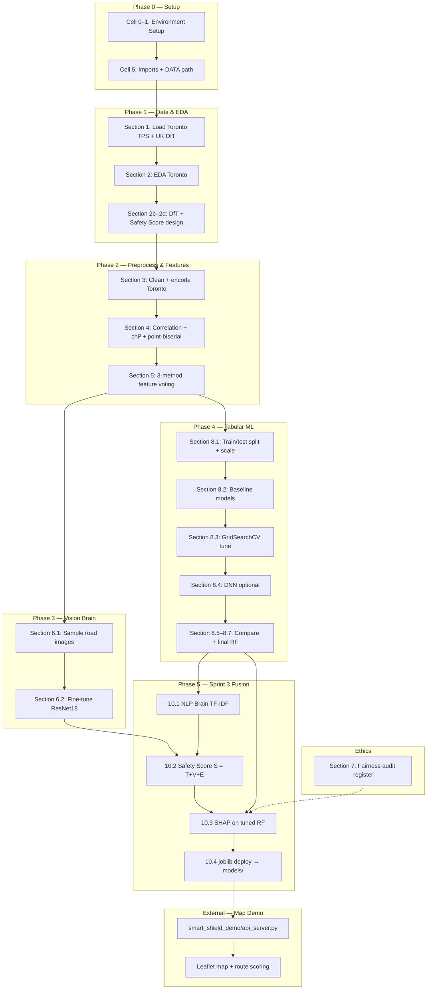
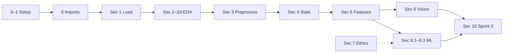
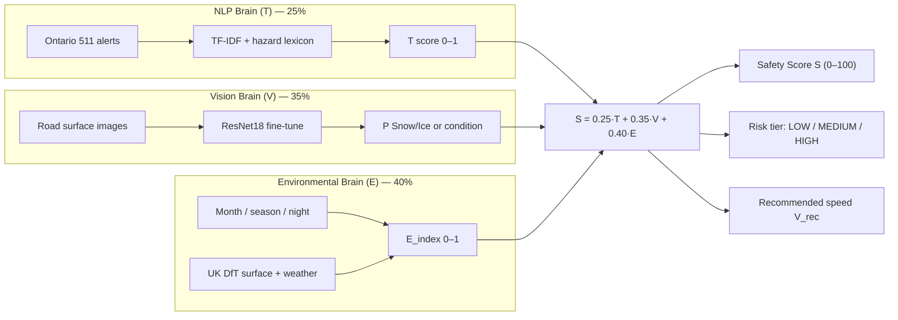
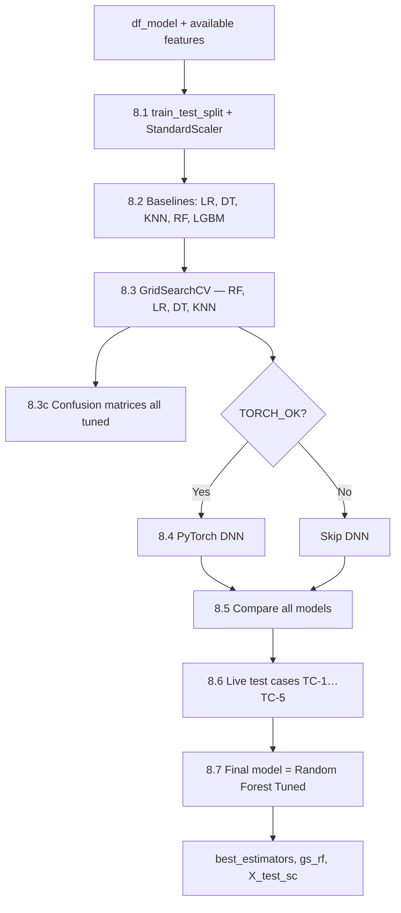
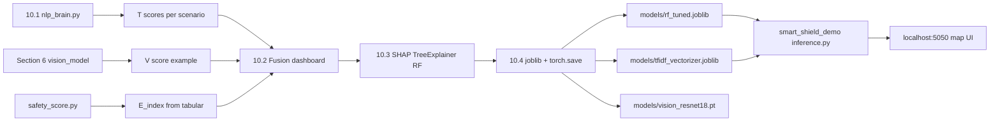

# Ontario Smart-Shield — ERD & Pipeline Flow Reference

**Notebook:** `Python Notebooks & Scripts/Captone - Draft.ipynb`  
**Project:** INFO53883 AI & ML Capstone · Team 2B  
**Purpose:** Reference map of data entities, model artifacts, and notebook execution flow.

---

## 1. High-Level Pipeline Flowchart



---

## 2. Run-All Sequence (Cell Order)



| Phase | Section | What runs | Key outputs |
|-------|---------|-----------|-------------|
| Setup | 0–1, 5 | Packages, `DATA`, `TORCH_OK` | `DATA`, `TORCH_OK`, imports |
| Data | 1 | `read_csv` Toronto + DfT | `df_toronto`, `dft` |
| EDA | 2–2d | Plots, severity target, Paper 2 stats | `df`, severity charts |
| Preprocess | 3 | Encode, filter, engineer time features | `df_model`, `X`, `y` |
| Stats | 4 | Heatmap, chi², point-biserial | correlation tables |
| Features | 5 | Chi² + MI + RF importance vote | `available` feature list |
| Vision | 6.1–6.2 | Cache images, ResNet18 8 epochs | `vision_model`, V-score |
| Ethics | 7 | Risk register checklist | audit table |
| ML | 8.1–8.7 | Baselines → GridSearch → DNN → compare | `best_estimators`, `gs_rf` |
| Sprint 3 | 10.1–10.4 | NLP, fusion dashboard, SHAP, save | `models/*.joblib`, `.pt` |

---

## 3. Data Entity Relationship Diagram (ERD)

```mermaid
erDiagram
    TORONTO_TPS ||--o{ COLLISION_EVENT : contains
    UK_DFT ||--o{ DFT_COLLISION : contains

    COLLISION_EVENT {
        datetime OCC_DATE
        int OCC_HOUR
        int MONTH_NUM
        int SEASON_NUM
        int IS_NIGHT
        int IS_RUSHHOUR
        int PEDESTRIAN_BIN
        int BICYCLE_BIN
        int AUTOMOBILE_BIN
        string severity_class
    }

    DFT_COLLISION {
        string weather_conditions
        string road_surface_conditions
        int casualty_severity
    }

    COLLISION_EVENT ||--|| FEATURE_MATRIX : transforms_to
    FEATURE_MATRIX {
        float scaled_features
        int label_PD_Injury_Fatal
    }

    FEATURE_MATRIX ||--o{ SKLEARN_MODEL : trains
    SKLEARN_MODEL {
        string model_name
        float accuracy
        float f1
    }

    ALERT_CORPUS ||--|| TFIDF_VECTORIZER : fits
    ALERT_CORPUS {
        text ontario_511_alert
        string scenario_TC1_to_TC5
    }

    TFIDF_VECTORIZER ||--|| NLP_SCORE_T : produces
    NLP_SCORE_T {
        float T_risk_0_to_1
    }

    VISION_CACHE ||--|| RESNET18 : fine_tunes
    VISION_CACHE {
        image clear_wet_snow
        path local_jpg
    }

    RESNET18 ||--|| VISION_SCORE_V : produces
    VISION_SCORE_V {
        float V_prob_snow_ice
    }

    ENV_FEATURES ||--|| E_INDEX : produces
    ENV_FEATURES {
        int month
        int season
        int is_night
        bool winter_storm
    }

    E_INDEX {
        float E_risk_0_to_1
    }

    NLP_SCORE_T ||--|| SAFETY_SCORE_S : fuses
    VISION_SCORE_V ||--|| SAFETY_SCORE_S : fuses
    E_INDEX ||--|| SAFETY_SCORE_S : fuses

    SAFETY_SCORE_S {
        float S_0_to_100
        string tier_LOW_MED_HIGH
        int V_rec_kmh
    }

    SKLEARN_MODEL ||--o{ DEPLOYED_ARTIFACT : serializes
    DEPLOYED_ARTIFACT {
        file rf_tuned.joblib
        file scaler.joblib
        file tfidf_vectorizer.joblib
        file vision_resnet18.pt
        file dnn_smart_shield.pt
    }

    SAFETY_SCORE_S ||--o{ MAP_ROUTE_OPTION : scores
    MAP_ROUTE_OPTION {
        float distance_km
        float duration_min
        int route_index
    }
```

---

## 4. Three-Brain Fusion (Safety Score S)



---

## 5. Section 8 — Modelling Detail Flow



---

## 6. Sprint 3 Deployment Flow



---

## 7. File & Module Reference

| Entity / Artifact | Location | Produced in |
|-------------------|----------|-------------|
| Raw Toronto CSV | `Data/traffic collision data.csv` | External (TPS) |
| Raw UK DfT CSV | `Data/dft-road-casualty-statistics-collision-2024.csv` | External (DfT) |
| Vision cache images | `Data/vision_cache/` | Sec 6 / `seed_vision_cache.py` |
| `nlp_brain.py` | Scripts folder | Sprint 3 |
| `safety_score.py` | Scripts folder | Sprint 3 |
| `vision_brain.py` | Scripts folder | Section 6 |
| `cm_helpers.py` | Scripts folder | Confusion matrix plots |
| Trained models | `models/*.joblib`, `*.pt` | Section 10.4 |
| Map demo | `smart_shield_demo/` | Post-notebook |

---

## 8. Key Variables (Cross-Section)

| Variable | Created in | Used in |
|----------|------------|---------|
| `df_toronto` | Section 1 | EDA, preprocess |
| `dft` | Section 1 | E_index calibration |
| `df_model` | Section 3 | Modelling |
| `available` | Section 5 | ML, SHAP feature names |
| `X_train_sc`, `X_test_sc` | Section 8.1 | All sklearn models |
| `best_estimators` | Section 8.3 | SHAP, deployment |
| `gs_rf` | Section 8.3 | Final RF params |
| `vision_model` | Section 6.2 | V-score, Sprint 3 |
| `TC` | Section 8.6 | Live test cases, fusion |
| `nlp_rows` | Section 10.1 | Safety dashboard |

---

## 9. Sprint Mapping (Project Timeline)

```mermaid
gantt
    title Smart-Shield Notebook Sprints
    dateFormat X
    axisFormat %s

    section Sprint 1-2
    Data EDA Preprocess     :s12, 0, 3
    Stats Feature Select    :s34, 3, 5

    section Sprint 2
    Vision Brain            :s6, 5, 6
    Baselines GridSearch    :s8, 6, 8
    Ethics Confusion Mats   :s7, 7, 8

    section Sprint 3
    NLP Fusion SHAP Deploy  :s10, 8, 10
    Map Demo localhost      :demo, 10, 11
```



---

## 10. Map Demo Connection (localhost)

The notebook trains and saves models; the **map demo** consumes them at runtime:

1. User enters origin/destination on **OpenStreetMap** (free).
2. **OSRM** returns 2–3 route alternatives (distance, duration).
3. **Flask API** (`inference.py`) scores each route with T+V+E → **S**.
4. UI ranks routes; **safest** = lowest S; shows **recommended speed**.

No Google billing required.

---

*Document generated for Ontario Smart-Shield capstone reference. Update section numbers if notebook cells are reordered.*
