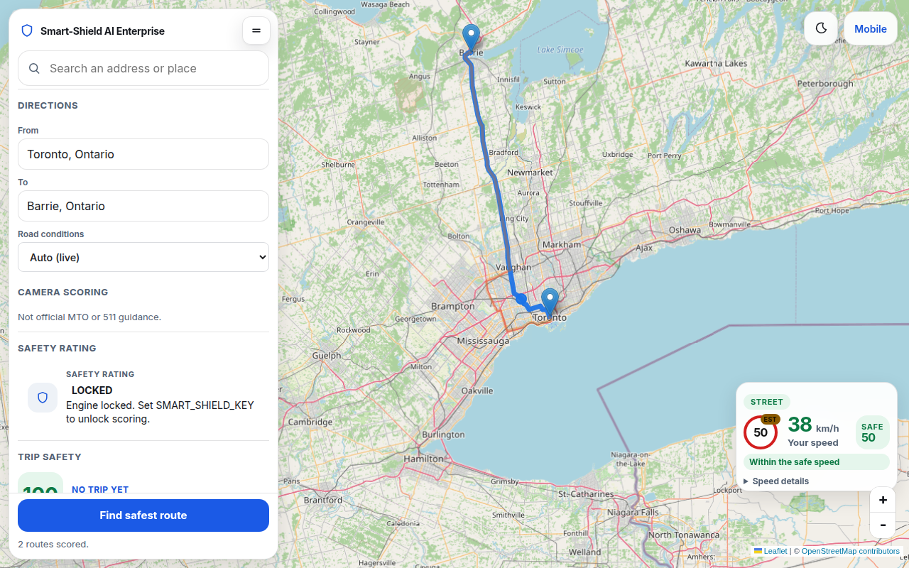
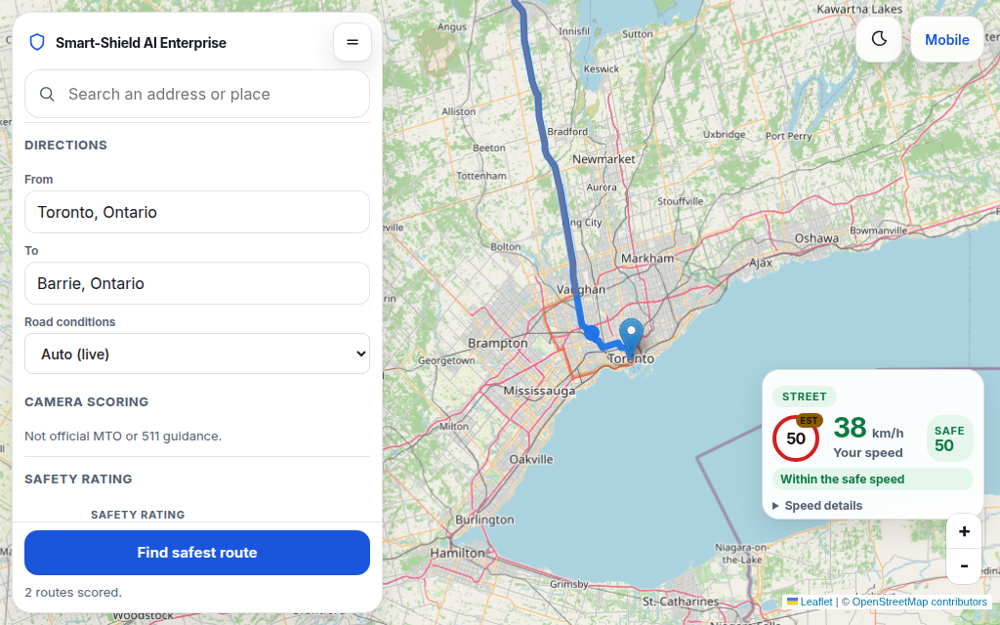
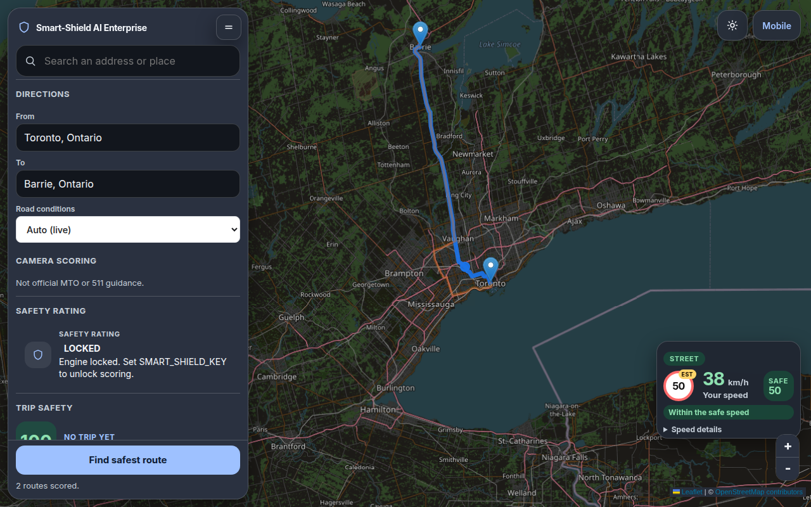
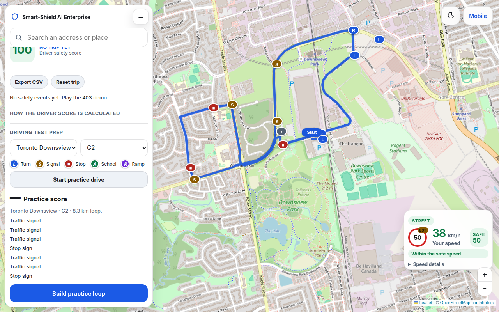
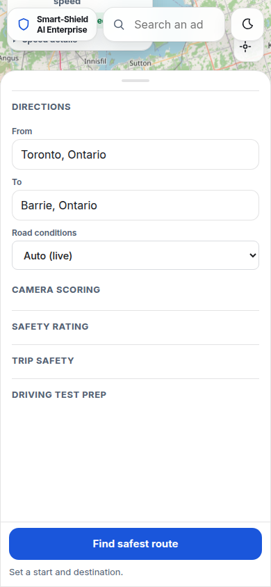

# Map screen update (September 2026)

This note explains the driving-map screen in the Enterprise demo: what was wrong, what changed, and how to use it. The pictures are the desktop and phone views after those fixes.

The live site is the Render URL for this repo. On a laptop, start `python api_server.py` in `demo/` and open `http://127.0.0.1:5050`. The phone layout is `/mobile` on that same server.

## What was wrong

The map worked, but the screen around it got in the way.

- **Stacked cards.** Search, directions, the safety rating, and trip safety were separate floating cards. Each card could scroll on its own, so the page had nested scrollbars and the map sat in a small gap.
- **A clipped button.** The main action (find a route, or later build a practice loop) could sit half off the bottom of a card, or two buttons could stack on top of each other.
- **The speed card covered the route.** A large speed panel sat over the middle of the map, so the highlighted drive was hard to see.
- **CARTO watermark tiles.** The basemap asked for a CARTO key. On the public site the tiles drew with an “API KEY REQUIRED” watermark.
- **Tile seams.** Neighbouring map tiles left a hairline gap, so the basemap looked striped.

## What changed, and why

- **One panel.** Search, Directions, Safety rating, Trip safety, and Driving test prep are sections of a single column on the left. The page itself does not scroll. The column scrolls as one piece, and the primary button stays in the footer so it is never clipped. Only the button for the section you are using is shown.
- **Speed sits in the corner.** The speed readout is a small widget at the lower right (on a phone, above the sheet). The long controls are inside **Speed details**, so they do not cover the route until you open them.
- **OpenStreetMap tiles, no key.** Day tiles come from `tile.openstreetmap.org`. They do not need an API key, so the public map has no CARTO watermark. If an optional tile server is configured and it fails, the map falls back to these tiles.
- **Night is the same tiles, darkened.** The night theme does not download a second map. It recolors the tile pane with a CSS filter. Roads and labels stay in place.
- **Tiles overlap by one pixel.** Each tile is drawn one pixel larger than its grid cell so the seams between tiles do not show.
- **Driving test prep.** You can build a practice loop around an Ontario DriveTest centre. The loop is a suggestion from public maps. It is not an official test route.

## How to use the screen

### The side panel

Open the desktop page. The column on the left has:

1. The Smart-Shield name and a collapse button.
2. **Search** — type a place. After a few letters, suggestions appear. You can set that place as From or To.
3. **Directions** — From, To, and road conditions (Auto, Clear, Wet, Blizzard, Ice storm). Camera scoring is under an extra disclosure. The footer button is **Find safest route**.
4. **Safety rating** — fills in after a route is scored. Open it for the suggested routes. Lower is safer.
5. **Trip safety** — the driver score for a played trip. The footer button for this section is **Play 403 exit demo**.
6. **Driving test prep** — described below. The footer button is **Build practice loop**.

Open a section by clicking its heading. The footer switches to that section’s button. Closing Test prep or Trip safety returns the footer to **Find safest route**.

The collapse button (the two lines beside the name) shrinks the column to the search bar so you can see more of the map. Click it again to open the sections.

### Corner speed widget

The widget shows three things: the posted **Limit**, **Your speed**, and the **Safe** speed, plus a short line such as “Within the safe speed”.

**Speed details** holds the rest: the road name, demo speed, beep, GPS, the speed slider, Under safe / Above safe / Over limit, and **Drive selected route**. Leave it closed during a normal look at the map.

On a laptop, **Demo speed** is on because the browser usually has no travel speed. **Use GPS** needs a secure page (HTTPS, or localhost).

### Night mode

The moon button at the top right switches between day and night. The choice is remembered in the browser. Night keeps the OpenStreetMap picture and darkens it. It does not swap in a different tile vendor.

### Mobile

Open `/mobile`. The map is full screen. Search and the theme button sit on the top bar. Directions and the other sections are in the bottom sheet. Drag or tap the handle to expand the sheet. The footer rule is the same: one primary button for the section you open. The speed widget sits above the sheet so it does not cover the button.

## Driving test prep

This is a practice aid for an Ontario G2 or G road test. It is not an examiner route and not an appointment system.

1. Open **Driving test prep** in the panel (or in the phone sheet).
2. Pick a centre. The list is the DriveTest directory (see Data sources). If the pin is the plaza or the street rather than the suite door, the panel says the map point is approximate.
3. Pick **G2** or **G**.
4. Press **Build practice loop**. The app asks the public road router for a circuit on nearby streets and draws it on the map. The line starts and ends at the centre marker, which is labelled **Start**.
5. Read the **legend** on the map markers:
   - Blue **L** or **R** — left or right turn
   - Amber **S** — traffic signal
   - Red square — stop sign
   - Green **A** — school or community safety zone
   - Purple **R** — highway on or off ramp
6. The panel lists those points in words. A ramp on a G2 loop is labelled as a G-test item and is not scored for G2.
7. Press **Start practice drive** to move along the loop. The practice score starts at 100 and drops for speeding or missed signals, stops, and similar events, using the same street-rule penalties as the trip score. When the drive finishes, the line under the score says it is a practice aid, not an examiner result.
8. The **pre-test checklist** (licence and appointment, ownership and insurance, mirrors, full stops, seatbelts) is saved in this browser only. It is a reminder, not a record sent to DriveTest.
9. The disclaimer under the checklist is the rule for this feature: *Practice suggestions only. These loops are generated from public maps. They are not official DriveTest routes or examiner paths.*

### Data sources

| Piece | Source |
| --- | --- |
| Centre names and addresses | DriveTest public directory on drivetest.ca, alphabetical list retrieved 27 September 2026. Brampton uses the Shoppers World address from the DriveTest relocation notice effective 8 June 2026. |
| Centre coordinates | Public geocoder. Exact when the hit is the named centre; marked approximate when the hit is a plaza, unit, or street. |
| The driven line | [OSRM](https://project-osrm.org/) public driving router. Waypoints sit on nearby public streets (about 1–3 km from the centre). Service roads, parking aisles, park roads, and freeway connectors are avoided. |
| Signals, stops, schools, and similar points | OpenStreetMap, read through the Overpass API, plus turn instructions from OSRM. |

## Engine-locked state

The scoring engine can be encrypted at rest. The map still opens when it is locked.

Without `SMART_SHIELD_KEY`, the safety rating shows **LOCKED** and the text “Engine locked. Set SMART_SHIELD_KEY to unlock scoring.” Route scores and trip scores that depend on the engine stay locked or estimated. Search, the map, the speed widget’s posted-limit lookup, and driving-test prep still run, because they use the map services above rather than the encrypted model.

On Render, set `SMART_SHIELD_KEY` on the web service (Environment), then redeploy. Do not put the key in the repo, in a screenshot, or in this document. How the key is created and stored is in [PROTECTING_IP.md](../PROTECTING_IP.md).

## Known limitations

- Practice loops are suggestions. They are not the route an examiner will use, and they are not approval to drive a particular road.
- Building a loop calls public OSRM and Overpass servers. The first request can take several seconds, and either service can be busy or down. If Overpass is down, the loop still draws from the road shape and says that live map features are unavailable.
- A loop prefers a short circuit on arterial streets. A residential connector can still appear where that is how the streets join. The picture drops a short out-and-back so the line does not show a dead-end spur; that drawn line can be a little shorter than the raw router distance.
- Some centre pins are approximate. Read the note under the centre name before you treat the pin as the front door.
- OpenStreetMap speed limits and traffic features are incomplete. A missing `maxspeed` becomes an estimate. A missing signal or stop will not appear as a practice point.
- Night mode is a recolor of the day tiles, not a separate basemap drawn for dark mode.
- The one-pixel tile overlap hides seams. It does not change the map data.
- The checklist stays in the browser that checked the boxes. It is not an account and not sent to DriveTest.
- While the engine is locked, do not treat the safety rating or the trip score as a real score. Set the key on Render to unlock them.

## Pictures

Day, 1280×800. One panel, Toronto to Barrie, speed widget in the corner, Find safest route in the footer.

Day, 1024×640. The same screen at a shorter window. The form and the footer button stay visible.

Night, 1280×800. The same OpenStreetMap tiles with the night filter. Panel text stays readable.

Driving test prep at Downsview. The legend, an 8.3 km G2 loop, and Build practice loop as the only footer button. The line starts and ends at the centre.

Phone, 390×844, sheet expanded. Directions and the other sections, with Find safest route as the only footer button.

